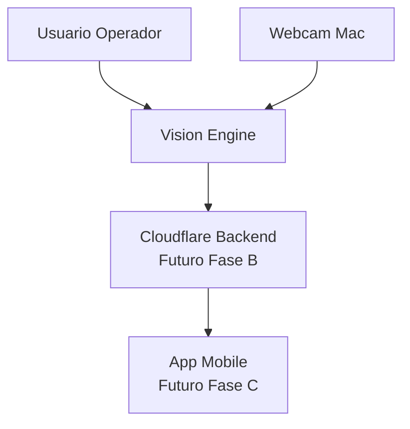

# C1 - Contexto del Sistema

Este nivel responde: **¿Qué es Vision Engine y con qué actores interactúa?**

## Diagrama C1

## Resumen

- El usuario ejecuta Vision Engine local.
- Vision Engine toma frames de webcam.
- Vision Engine genera detecciones/eventos.
- Backend y móvil están planificados para fases posteriores.

## Zoom siguiente

Ir a [C2 - Contenedores](c2_contenedores.md).
