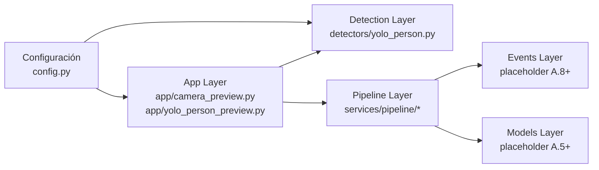

# C2 - Contenedores

Este nivel responde: **¿Qué bloques de software componen Vision Engine?**

## Diagrama C2

## Contenedores actuales

1. Configuración: defaults y env vars para cámara/YOLO.
2. App Layer: entrypoints de cámara y YOLO preview.
3. Detection Layer: adaptación de salida YOLO a estructura del proyecto.
4. Pipeline Layer: contratos desacoplados provider/processor/renderer.

## Contenedores futuros

- Events Layer: emisión y manejo de eventos de dominio.
- Models Layer: entidades de detección/tracking desacopladas de Ultralytics.

## Zoom siguiente

Ir a [C3 - Componentes](c3_componentes.md).
