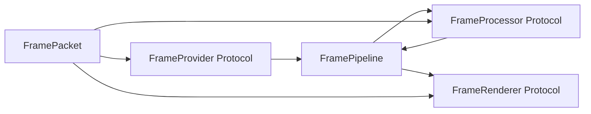
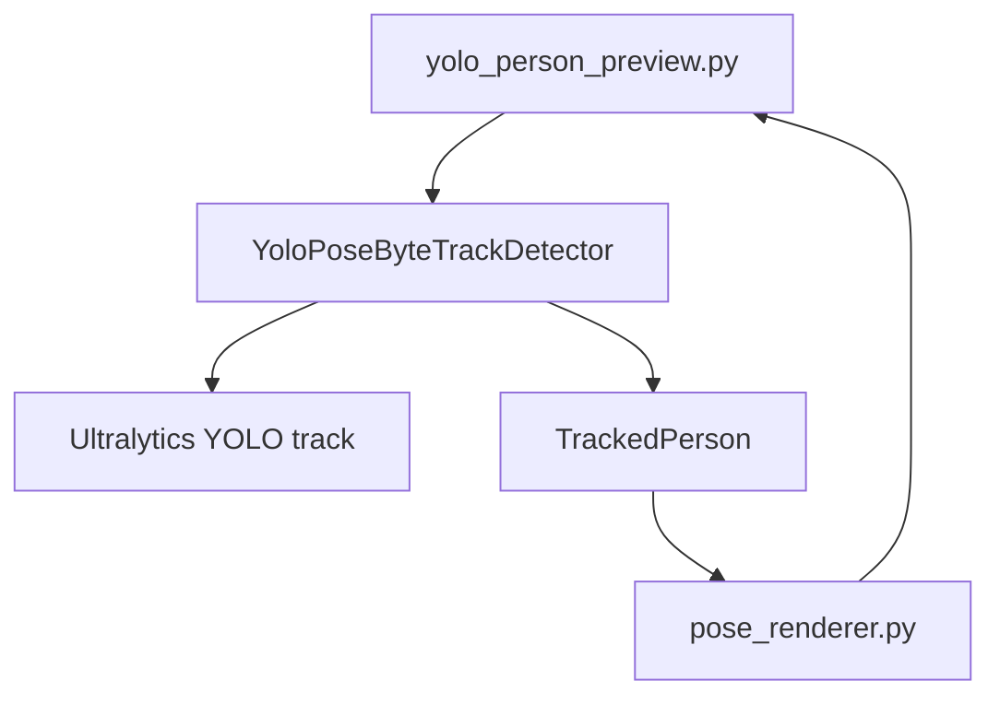
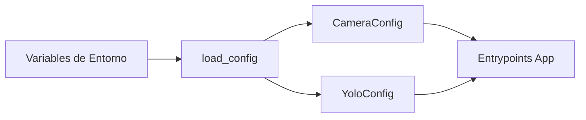

# C3 - Componentes

Este nivel responde: **¿Qué módulos/clases componen cada contenedor y cómo se conectan?**

## C3.1 Pipeline

Componentes clave:

1. `FrameProvider`: fuente de frames (mock/webcam/RTSP futuro).
2. `FrameProcessor`: transforma frame de entrada en salida.
3. `FrameRenderer`: presenta o persiste resultados.
4. `FramePipeline`: orquesta el ciclo de ejecución.

## C3.2 Detección YOLO

Componentes clave:

1. `YoloPoseByteTrackDetector.from_model_path()`: carga modelo y tracker config.
2. `YoloPoseByteTrackDetector.detect()`: filtra `person` y mapea a `TrackedPerson`.
3. `TrackedPerson`: `track_id` + `Detection` + `keypoints` opcionales.
4. `pose_renderer.py`: dibuja bbox, keypoints, skeleton y overlays globales.

## C3.3 Configuración

## Zoom siguiente

Ir a [C4 - Código](c4_codigo.md).
