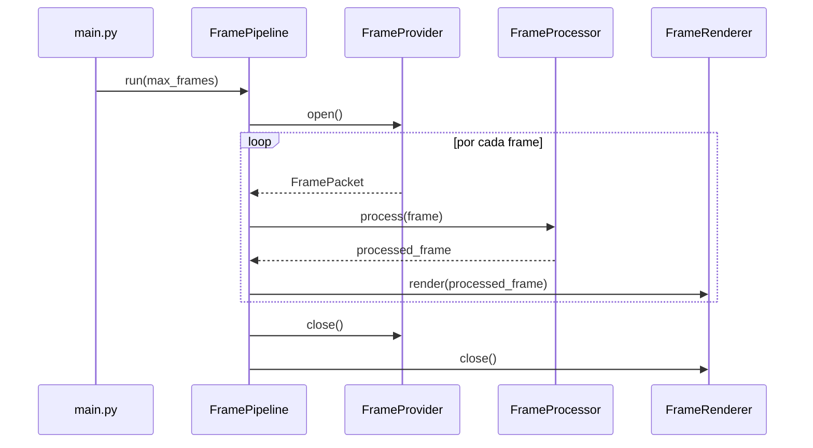
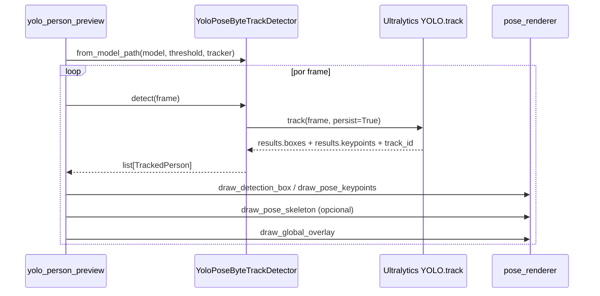
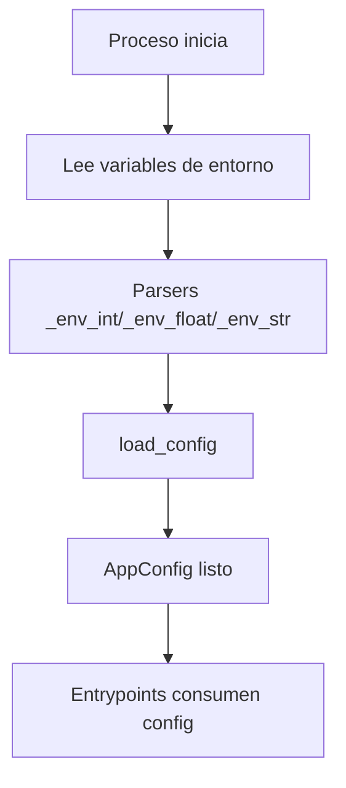

# C4 - Código (Funciones y Conexiones)

Este nivel responde: **¿Qué funciones/métodos coordinan el comportamiento real?**

Si necesitas ver primero el cableado completo de objetos y flujo de frame, revisa antes `c4b_wiring_example.md`.

## C4.1 Flujo de ejecución del pipeline

Métodos clave:

1. `FramePipeline.run()`
2. `FramePipeline._open_resources()`
3. `FramePipeline._close_resources()`
4. `FramePipeline._should_stop()`

## C4.2 Flujo de detección YOLO

Funciones clave:

1. `run_yolo_person_preview()`
2. `YoloPoseByteTrackDetector.detect()`
3. `draw_pose_keypoints()`
4. `draw_pose_skeleton()`
5. `draw_global_overlay()`

## C4.3 Flujo de configuración

## Detalles on demand

Si quieres profundizar en código:

1. Revisa `services/pipeline/engine.py` para ciclo de vida del pipeline.
2. Revisa `detectors/yolo_pose_bytetrack.py` para mapeo YOLO/ByteTrack -> dominio.
3. Revisa `config.py` para precedencia de configuración.

## Zoom atrás

Volver a [C3 - Componentes](c3_componentes.md) o [README C4](README.md).
