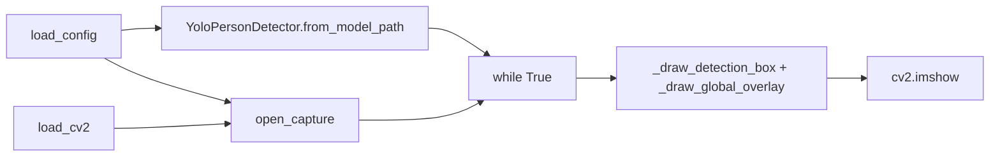
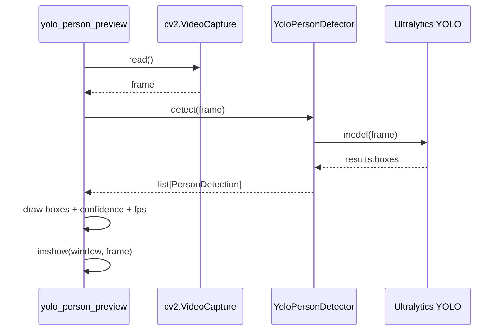

# C4b - Wiring End-to-End

Este documento conecta C3 y C4 en un solo recorrido: como se conectan objetos y como viaja un frame hasta pantalla.

## Wiring de objetos (runtime)

## Secuencia de un frame

## Donde mirar en codigo

1. Setup y loop principal: `app/yolo_person_preview.py`
2. Parseo/filtro YOLO: `detectors/yolo_person.py`
3. Configuracion de defaults/env: `config.py`

## Relacion con C4 principal

Si quieres detalle por metodos, continua en `c4_codigo.md`.
